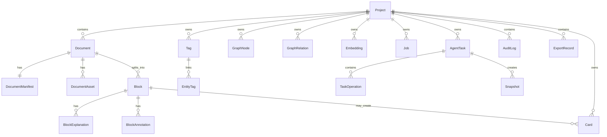

# KnowledgeOS 数据库 Schema 设计（MVP / Tauri + Rust 版）

> 目标：给 **纯 AI 开发** 直接使用的一版数据库设计文档。
> 
> 这份文档优先解决 4 件事：
> 1. 表结构稳定，方便 AI 连续开发。
> 2. 迁移顺序清晰，方便逐步落地。
> 3. 字段和状态尽量显式，减少隐式逻辑。
> 4. 先保证 MVP 可实现，再为 V1 预留扩展位。

---

## 1. 设计结论

### 1.1 推荐数据库方案

MVP 采用：

- **SQLite**：主数据库
- **FTS5**：全文检索
- **SQLite JSON1**：JSON 字段
- **向量数据先存在 SQLite**，后续如有必要再替换为 sqlite-vec / 外部本地向量引擎

### 1.2 为什么先不用复杂向量库

对纯 AI 开发来说，先把接口做稳定，比先接复杂向量引擎更重要。

MVP 建议：

- embedding 元数据存在 SQLite
- 向量先用 `vector_json` 存 JSON 数组
- Rust 侧先做小规模余弦相似度召回
- 等数据量明显变大，再替换为更高性能方案

这样做的好处：

- schema 不用推倒重来
- 搜索接口可以先稳定
- AI 编码更容易一次写通

### 1.3 数据库在系统中的定位

SQLite 是 **唯一业务真相源**，负责保存：

- Project 元数据
- Document / Block / Card / Graph 元数据
- Explain 缓存
- Agent 任务与日志
- 快照与审计
- FTS 索引元数据
- Embedding 元数据

以下内容不直接放进数据库正文：

- 原始文件二进制
- 规范化 Markdown 文件本体
- 图片/资产文件
- 快照文件本体
- 导出文件

这些内容保存在项目目录中，数据库保存相对路径和索引信息。

---

## 2. 设计原则

### 2.1 Block-first

数据库最重要的领域对象不是 Document，而是 **Block**。

因为：

- 阅读器按 Block 工作
- Explain 绑定 Block
- Card 常常来源于 Block
- Graph 的来源引用最终要能回到 Block
- Search 的最小语义单元也应是 Block

### 2.2 Source-grounded

所有 AI 输出都必须能追溯：

- Explain -> block_id
- Card -> source_block_id / source_explanation_id
- GraphRelation -> source_ref_json
- Agent 改动 -> task_id + snapshot_id + audit_log

### 2.3 AI-friendly Schema

为了让 AI 更容易正确实现，Schema 采用以下约束：

- 尽量使用简单主键：`TEXT PRIMARY KEY`
- 状态使用 `TEXT + CHECK`
- 灵活字段使用 `TEXT(JSON)`
- 复杂索引尽量少而明确
- FTS 与 Embedding 索引视为 **可重建副本**，不是唯一真相
- 避免过深触发器链，优先使用应用层同步

### 2.4 Local-first

数据库不依赖中心服务。

- 删除 Project 时，应能本地级联清理
- 日志、任务、快照、索引都可本地恢复
- 不把模型凭证写入数据库，凭证应存系统 Keychain

---

## 3. 技术约定

### 3.1 SQLite 版本要求

建议：

- SQLite >= 3.42
- 开启 FTS5
- 开启 JSON1
- 可使用 `STRICT` 表

### 3.2 启动时 PRAGMA

```sql
PRAGMA journal_mode = WAL;
PRAGMA foreign_keys = ON;
PRAGMA synchronous = NORMAL;
PRAGMA temp_store = MEMORY;
PRAGMA cache_size = -20000;
PRAGMA busy_timeout = 5000;
```

### 3.3 时间字段约定

统一使用：

- `INTEGER`
- 单位：`unix epoch milliseconds`
- 命名：`*_at_ms`

原因：

- Rust / TypeScript 易处理
- 排序方便
- 不依赖 SQLite 日期函数

### 3.4 ID 约定

统一使用 `TEXT` 主键。

建议：

- `project_id` / `document_id` / `card_id` / `task_id`：ULID 或 UUIDv7
- `block_id`：稳定派生 ID，优先基于内容与锚点生成
- `relation_id`：ULID

### 3.5 路径约定

数据库中除 `projects.root_path` 外，其他路径尽量使用 **相对项目根目录的相对路径**。

示例：

- `source/lecture01.pdf`
- `normalized/docs/doc_001.md`
- `snapshots/task_001/file_rename_before.md`

### 3.6 JSON 字段约定

所有 JSON 字段：

- 类型用 `TEXT`
- 约束用 `CHECK (json_valid(...))`
- 默认值尽量是 `'{}'` 或 `'[]'`

---

## 4. 总体逻辑模型



---

## 5. 核心表总览

| 表名 | 作用 | MVP | 来源真相级别 |
|---|---|---:|---|
| app_meta | 应用元信息 | P0 | 真相源 |
| app_settings | 应用级设置 | P0 | 真相源 |
| project_settings | 项目级设置 | P1 | 真相源 |
| projects | 项目空间 | P0 | 真相源 |
| documents | 原始导入文档索引 | P0 | 真相源 |
| document_manifests | 文档标准化元数据 | P0 | 真相源 |
| document_assets | 文档资产索引 | P0 | 真相源 |
| blocks | 阅读与解释最小单元 | P0 | 真相源 |
| block_explanations | 块级 AI 解读缓存 | P0 | 真相源 |
| block_annotations | 用户注释/收藏/问题 | P1 | 真相源 |
| cards | 知识卡片 | P0 | 真相源 |
| tags | 标签 | P1 | 真相源 |
| entity_tags | 实体标签映射 | P1 | 真相源 |
| graph_nodes | 图谱节点 | P0 | 真相源 |
| graph_relations | 图谱关系 | P0 | 真相源 |
| embeddings | 向量与语义检索索引 | P0 | 可重建索引 |
| jobs | 后台任务队列 | P0 | 真相源 |
| agent_tasks | Agent 任务主表 | P0 | 真相源 |
| task_operations | Agent 操作步骤 | P0 | 真相源 |
| snapshots | 回滚快照索引 | P0 | 真相源 |
| audit_logs | 审计日志 | P0 | 真相源 |
| export_records | 导出记录 | P1 | 真相源 |
| documents_fts | 文档全文索引 | P0 | 可重建副本 |
| blocks_fts | Block 全文索引 | P0 | 可重建副本 |
| cards_fts | Card 全文索引 | P0 | 可重建副本 |

---

## 6. 状态枚举定义

### 6.1 documents.parse_status

- `imported`
- `parsing`
- `normalized`
- `chunked`
- `indexed`
- `ready`
- `failed`

### 6.2 block_explanations.status

- `queued`
- `running`
- `ready`
- `failed`

### 6.3 jobs.status

- `pending`
- `running`
- `succeeded`
- `failed`
- `cancelled`

### 6.4 agent_tasks.status

- `drafted`
- `planned`
- `awaiting_approval`
- `executing`
- `completed`
- `failed`
- `rolled_back`
- `cancelled`

### 6.5 graph_nodes.status

- `active`
- `hidden`
- `archived`

### 6.6 cards.status

- `active`
- `archived`

---

## 7. 表结构设计

## 7.1 app_meta

用途：保存 schema 版本、数据库创建信息、兼容性元信息。

```sql
CREATE TABLE app_meta (
  meta_key        TEXT PRIMARY KEY,
  value_json      TEXT NOT NULL CHECK (json_valid(value_json)),
  updated_at_ms   INTEGER NOT NULL
) STRICT;
```

建议内容：

- `schema_version`
- `db_created_at_ms`
- `last_migration_id`
- `app_build_info`

---

## 7.2 app_settings

用途：应用级设置，不绑定项目。

```sql
CREATE TABLE app_settings (
  setting_key     TEXT PRIMARY KEY,
  value_json      TEXT NOT NULL CHECK (json_valid(value_json)),
  updated_at_ms   INTEGER NOT NULL
) STRICT;
```

示例：

- UI 主题
- 默认模型配置（非密钥）
- 是否允许云模型
- 日志级别

---

## 7.3 project_settings

用途：项目级设置，例如当前项目默认解释模式、搜索策略、导出模板。

```sql
CREATE TABLE project_settings (
  project_id      TEXT NOT NULL,
  setting_key     TEXT NOT NULL,
  value_json      TEXT NOT NULL CHECK (json_valid(value_json)),
  updated_at_ms   INTEGER NOT NULL,
  PRIMARY KEY (project_id, setting_key),
  FOREIGN KEY (project_id) REFERENCES projects(project_id) ON DELETE CASCADE
) STRICT;
```

---

## 7.4 projects

用途：工作空间主表。

```sql
CREATE TABLE projects (
  project_id        TEXT PRIMARY KEY,
  name              TEXT NOT NULL,
  slug              TEXT,
  root_path         TEXT NOT NULL UNIQUE,
  description       TEXT NOT NULL DEFAULT '',
  status            TEXT NOT NULL CHECK (status IN ('active', 'archived')),
  created_at_ms     INTEGER NOT NULL,
  updated_at_ms     INTEGER NOT NULL,
  last_opened_at_ms INTEGER
) STRICT;
```

索引：

```sql
CREATE INDEX idx_projects_status ON projects(status);
CREATE INDEX idx_projects_last_opened ON projects(last_opened_at_ms DESC);
```

说明：

- `root_path` 指向项目根目录
- 项目删除时应由应用层先删文件，再删数据库记录

---

## 7.5 documents

用途：导入文档主表。

```sql
CREATE TABLE documents (
  document_id            TEXT PRIMARY KEY,
  project_id             TEXT NOT NULL,
  source_rel_path        TEXT NOT NULL,
  original_filename      TEXT NOT NULL,
  source_type            TEXT NOT NULL CHECK (source_type IN ('pdf', 'pptx', 'docx', 'md', 'txt')),
  source_hash            TEXT NOT NULL,
  size_bytes             INTEGER NOT NULL DEFAULT 0 CHECK (size_bytes >= 0),
  title                  TEXT NOT NULL,
  language               TEXT,
  page_count             INTEGER,
  parse_status           TEXT NOT NULL CHECK (parse_status IN ('imported', 'parsing', 'normalized', 'chunked', 'indexed', 'ready', 'failed')),
  parse_error            TEXT,
  normalized_md_rel_path TEXT,
  manifest_rel_path      TEXT,
  blocks_rel_path        TEXT,
  imported_at_ms         INTEGER NOT NULL,
  updated_at_ms          INTEGER NOT NULL,
  UNIQUE (project_id, source_hash),
  FOREIGN KEY (project_id) REFERENCES projects(project_id) ON DELETE CASCADE
) STRICT;
```

索引：

```sql
CREATE INDEX idx_documents_project_status ON documents(project_id, parse_status);
CREATE INDEX idx_documents_project_title ON documents(project_id, title);
CREATE INDEX idx_documents_imported_at ON documents(project_id, imported_at_ms DESC);
```

说明：

- `source_hash` 用于避免重复导入
- `normalized_md_rel_path` 指向标准化 Markdown
- `manifest_rel_path` 指向 manifest JSON 文件
- `blocks_rel_path` 可选，指向该文档的 block dump / jsonl

---

## 7.6 document_manifests

用途：保存标准化解析输出的结构元数据。

```sql
CREATE TABLE document_manifests (
  document_id        TEXT PRIMARY KEY,
  project_id         TEXT NOT NULL,
  parser_name        TEXT NOT NULL,
  parser_version     TEXT NOT NULL,
  manifest_json      TEXT NOT NULL CHECK (json_valid(manifest_json)),
  anchor_map_json    TEXT NOT NULL CHECK (json_valid(anchor_map_json)),
  warnings_json      TEXT NOT NULL DEFAULT '[]' CHECK (json_valid(warnings_json)),
  normalized_at_ms   INTEGER NOT NULL,
  updated_at_ms      INTEGER NOT NULL,
  FOREIGN KEY (document_id) REFERENCES documents(document_id) ON DELETE CASCADE,
  FOREIGN KEY (project_id) REFERENCES projects(project_id) ON DELETE CASCADE
) STRICT;
```

`manifest_json` 建议包含：

- 标题层级
- 页码 / slide 信息
- 图片引用
- 表格引用
- 文档级解析摘要

`anchor_map_json` 建议包含：

- 页面/幻灯片到标准化文本块的映射
- 标题到原始位置的映射
- 原文定位所需的精确锚点

---

## 7.7 document_assets

用途：记录图片、页面截图、抽取出来的资源。

```sql
CREATE TABLE document_assets (
  asset_id         TEXT PRIMARY KEY,
  document_id      TEXT NOT NULL,
  project_id       TEXT NOT NULL,
  asset_type       TEXT NOT NULL CHECK (asset_type IN ('image', 'table_preview', 'page_preview', 'attachment', 'other')),
  rel_path         TEXT NOT NULL,
  mime_type        TEXT,
  page_no          INTEGER,
  slide_no         INTEGER,
  ordinal          INTEGER NOT NULL DEFAULT 0,
  width            INTEGER,
  height           INTEGER,
  created_at_ms    INTEGER NOT NULL,
  FOREIGN KEY (document_id) REFERENCES documents(document_id) ON DELETE CASCADE,
  FOREIGN KEY (project_id) REFERENCES projects(project_id) ON DELETE CASCADE,
  UNIQUE (document_id, rel_path)
) STRICT;
```

索引：

```sql
CREATE INDEX idx_document_assets_doc_page ON document_assets(document_id, page_no, slide_no, ordinal);
```

---

## 7.8 blocks

用途：系统最核心的阅读与解释单元。

```sql
CREATE TABLE blocks (
  block_id             TEXT PRIMARY KEY,
  project_id           TEXT NOT NULL,
  document_id          TEXT NOT NULL,
  parent_block_id      TEXT,
  block_type           TEXT NOT NULL CHECK (block_type IN ('heading', 'section', 'paragraph', 'list', 'table', 'figure', 'equation', 'slide', 'quote', 'code', 'other')),
  heading_path_json    TEXT NOT NULL DEFAULT '[]' CHECK (json_valid(heading_path_json)),
  order_index          INTEGER NOT NULL,
  depth                INTEGER NOT NULL DEFAULT 0 CHECK (depth >= 0),
  start_anchor         TEXT NOT NULL,
  end_anchor           TEXT,
  source_page_from     INTEGER,
  source_page_to       INTEGER,
  source_slide_from    INTEGER,
  source_slide_to      INTEGER,
  token_count          INTEGER NOT NULL DEFAULT 0 CHECK (token_count >= 0),
  char_count           INTEGER NOT NULL DEFAULT 0 CHECK (char_count >= 0),
  content_md           TEXT NOT NULL,
  content_hash         TEXT NOT NULL,
  created_at_ms        INTEGER NOT NULL,
  updated_at_ms        INTEGER NOT NULL,
  FOREIGN KEY (project_id) REFERENCES projects(project_id) ON DELETE CASCADE,
  FOREIGN KEY (document_id) REFERENCES documents(document_id) ON DELETE CASCADE,
  FOREIGN KEY (parent_block_id) REFERENCES blocks(block_id) ON DELETE CASCADE,
  UNIQUE (document_id, order_index),
  UNIQUE (document_id, start_anchor, content_hash)
) STRICT;
```

索引：

```sql
CREATE INDEX idx_blocks_project_doc_order ON blocks(project_id, document_id, order_index);
CREATE INDEX idx_blocks_document_parent ON blocks(document_id, parent_block_id);
CREATE INDEX idx_blocks_document_anchor ON blocks(document_id, start_anchor);
```

设计说明：

- `block_id` 建议由应用层稳定生成
- `heading_path_json` 便于阅读器构建目录树
- `start_anchor` / `end_anchor` 支持回跳原文
- `content_md` 是 Block 主体内容真相源

推荐 block_id 生成输入：

```text
{document_id}:{normalized_heading_path}:{start_anchor}:{content_hash_prefix}
```

---

## 7.9 block_explanations

用途：块级 AI 解读缓存与版本记录。

```sql
CREATE TABLE block_explanations (
  explanation_id     TEXT PRIMARY KEY,
  project_id         TEXT NOT NULL,
  block_id           TEXT NOT NULL,
  mode               TEXT NOT NULL CHECK (mode IN ('default', 'beginner', 'exam', 'research')),
  provider_name      TEXT NOT NULL,
  model_name         TEXT NOT NULL,
  prompt_version     TEXT NOT NULL,
  schema_version     TEXT NOT NULL,
  cache_key          TEXT NOT NULL,
  status             TEXT NOT NULL CHECK (status IN ('queued', 'running', 'ready', 'failed')),
  summary            TEXT,
  explanation_json   TEXT CHECK (explanation_json IS NULL OR json_valid(explanation_json)),
  tokens_input       INTEGER NOT NULL DEFAULT 0,
  tokens_output      INTEGER NOT NULL DEFAULT 0,
  cost_microunits    INTEGER NOT NULL DEFAULT 0,
  error_text         TEXT,
  created_at_ms      INTEGER NOT NULL,
  updated_at_ms      INTEGER NOT NULL,
  FOREIGN KEY (project_id) REFERENCES projects(project_id) ON DELETE CASCADE,
  FOREIGN KEY (block_id) REFERENCES blocks(block_id) ON DELETE CASCADE,
  UNIQUE (block_id, mode, model_name, prompt_version)
) STRICT;
```

索引：

```sql
CREATE INDEX idx_block_explanations_block_mode ON block_explanations(block_id, mode, status);
CREATE INDEX idx_block_explanations_project_created ON block_explanations(project_id, created_at_ms DESC);
```

`explanation_json` 建议结构：

```json
{
  "summary": "本块摘要",
  "key_concepts": [{"term": "概念A", "explanation": "解释"}],
  "role_in_document": "本块在整篇资料中的作用",
  "prerequisites": ["先修知识1"],
  "pitfalls": ["常见误区1"],
  "examples": ["例子1"],
  "related_candidates": [
    {"label": "相关概念", "relation_hint": "prerequisite", "confidence": 0.82}
  ]
}
```

---

## 7.10 block_annotations

用途：保存用户在 Block 上的手动行为。

```sql
CREATE TABLE block_annotations (
  annotation_id      TEXT PRIMARY KEY,
  project_id         TEXT NOT NULL,
  block_id           TEXT NOT NULL,
  annotation_type    TEXT NOT NULL CHECK (annotation_type IN ('note', 'bookmark', 'question', 'highlight')),
  content_md         TEXT NOT NULL DEFAULT '',
  color              TEXT,
  metadata_json      TEXT NOT NULL DEFAULT '{}' CHECK (json_valid(metadata_json)),
  created_at_ms      INTEGER NOT NULL,
  updated_at_ms      INTEGER NOT NULL,
  FOREIGN KEY (project_id) REFERENCES projects(project_id) ON DELETE CASCADE,
  FOREIGN KEY (block_id) REFERENCES blocks(block_id) ON DELETE CASCADE
) STRICT;
```

说明：

- `bookmark` 可让 `content_md=''`
- `metadata_json` 可预留高亮范围、前端折叠状态等信息

---

## 7.11 cards

用途：知识沉淀主表。

```sql
CREATE TABLE cards (
  card_id                TEXT PRIMARY KEY,
  project_id             TEXT NOT NULL,
  source_block_id        TEXT,
  source_explanation_id  TEXT,
  title                  TEXT NOT NULL,
  content_md             TEXT NOT NULL,
  card_type              TEXT NOT NULL CHECK (card_type IN ('note', 'concept', 'summary', 'qa', 'flashcard')),
  status                 TEXT NOT NULL DEFAULT 'active' CHECK (status IN ('active', 'archived')),
  created_by             TEXT NOT NULL CHECK (created_by IN ('user', 'ai', 'system')),
  dedupe_key             TEXT,
  created_at_ms          INTEGER NOT NULL,
  updated_at_ms          INTEGER NOT NULL,
  FOREIGN KEY (project_id) REFERENCES projects(project_id) ON DELETE CASCADE,
  FOREIGN KEY (source_block_id) REFERENCES blocks(block_id) ON DELETE SET NULL,
  FOREIGN KEY (source_explanation_id) REFERENCES block_explanations(explanation_id) ON DELETE SET NULL
) STRICT;
```

索引：

```sql
CREATE INDEX idx_cards_project_updated ON cards(project_id, updated_at_ms DESC);
CREATE INDEX idx_cards_project_type ON cards(project_id, card_type, status);
CREATE INDEX idx_cards_source_block ON cards(source_block_id);
```

说明：

- `dedupe_key` 用于后续合并候选，不必唯一
- `source_block_id` 删除时使用 `SET NULL`，防止重切块后卡片丢失

---

## 7.12 tags

用途：项目内标签字典。

```sql
CREATE TABLE tags (
  tag_id            TEXT PRIMARY KEY,
  project_id        TEXT NOT NULL,
  name              TEXT NOT NULL,
  slug              TEXT NOT NULL,
  color             TEXT,
  created_at_ms     INTEGER NOT NULL,
  FOREIGN KEY (project_id) REFERENCES projects(project_id) ON DELETE CASCADE,
  UNIQUE (project_id, slug)
) STRICT;
```

---

## 7.13 entity_tags

用途：将标签挂到 document / block / card / graph_node。

```sql
CREATE TABLE entity_tags (
  project_id        TEXT NOT NULL,
  entity_type       TEXT NOT NULL CHECK (entity_type IN ('document', 'block', 'card', 'graph_node')),
  entity_id         TEXT NOT NULL,
  tag_id            TEXT NOT NULL,
  created_at_ms     INTEGER NOT NULL,
  PRIMARY KEY (entity_type, entity_id, tag_id),
  FOREIGN KEY (project_id) REFERENCES projects(project_id) ON DELETE CASCADE,
  FOREIGN KEY (tag_id) REFERENCES tags(tag_id) ON DELETE CASCADE
) STRICT;
```

索引：

```sql
CREATE INDEX idx_entity_tags_project ON entity_tags(project_id, entity_type, entity_id);
CREATE INDEX idx_entity_tags_tag ON entity_tags(tag_id);
```

---

## 7.14 graph_nodes

用途：知识图谱节点。

```sql
CREATE TABLE graph_nodes (
  node_id              TEXT PRIMARY KEY,
  project_id           TEXT NOT NULL,
  node_type            TEXT NOT NULL CHECK (node_type IN ('document', 'card', 'concept', 'topic')),
  source_entity_type   TEXT CHECK (source_entity_type IN ('document', 'block', 'card', 'manual', 'system')),
  source_entity_id     TEXT,
  canonical_key        TEXT,
  title                TEXT NOT NULL,
  summary              TEXT NOT NULL DEFAULT '',
  aliases_json         TEXT NOT NULL DEFAULT '[]' CHECK (json_valid(aliases_json)),
  metadata_json        TEXT NOT NULL DEFAULT '{}' CHECK (json_valid(metadata_json)),
  status               TEXT NOT NULL DEFAULT 'active' CHECK (status IN ('active', 'hidden', 'archived')),
  created_at_ms        INTEGER NOT NULL,
  updated_at_ms        INTEGER NOT NULL,
  FOREIGN KEY (project_id) REFERENCES projects(project_id) ON DELETE CASCADE
) STRICT;
```

索引：

```sql
CREATE INDEX idx_graph_nodes_project_type ON graph_nodes(project_id, node_type, status);
CREATE INDEX idx_graph_nodes_source_entity ON graph_nodes(source_entity_type, source_entity_id);
CREATE UNIQUE INDEX idx_graph_nodes_project_canonical ON graph_nodes(project_id, node_type, canonical_key) WHERE canonical_key IS NOT NULL;
```

设计说明：

- `document` / `card` 节点可以是投影节点
- `concept` / `topic` 节点可以是 AI 或用户创建的独立实体
- `canonical_key` 用于去重，例如小写 slug

---

## 7.15 graph_relations

用途：图谱边。

```sql
CREATE TABLE graph_relations (
  relation_id         TEXT PRIMARY KEY,
  project_id          TEXT NOT NULL,
  from_node_id        TEXT NOT NULL,
  to_node_id          TEXT NOT NULL,
  relation_type       TEXT NOT NULL CHECK (relation_type IN ('defines', 'belongs_to', 'prerequisite', 'causes', 'compares', 'example_of', 'extends', 'related_to', 'same_source')),
  origin_type         TEXT NOT NULL CHECK (origin_type IN ('user', 'rule', 'ai_suggested', 'ai_confirmed')),
  source_ref_json     TEXT NOT NULL DEFAULT '{}' CHECK (json_valid(source_ref_json)),
  confidence          REAL NOT NULL DEFAULT 1.0 CHECK (confidence >= 0 AND confidence <= 1),
  confirmed_by_user   INTEGER NOT NULL DEFAULT 0 CHECK (confirmed_by_user IN (0, 1)),
  created_at_ms       INTEGER NOT NULL,
  updated_at_ms       INTEGER NOT NULL,
  FOREIGN KEY (project_id) REFERENCES projects(project_id) ON DELETE CASCADE,
  FOREIGN KEY (from_node_id) REFERENCES graph_nodes(node_id) ON DELETE CASCADE,
  FOREIGN KEY (to_node_id) REFERENCES graph_nodes(node_id) ON DELETE CASCADE,
  UNIQUE (project_id, from_node_id, to_node_id, relation_type)
) STRICT;
```

索引：

```sql
CREATE INDEX idx_graph_rel_from ON graph_relations(project_id, from_node_id, relation_type);
CREATE INDEX idx_graph_rel_to ON graph_relations(project_id, to_node_id, relation_type);
CREATE INDEX idx_graph_rel_origin ON graph_relations(project_id, origin_type, confirmed_by_user);
```

`source_ref_json` 建议包含：

```json
{
  "block_ids": ["blk_001", "blk_002"],
  "explanation_ids": ["exp_001"],
  "rule_name": "same_heading_or_concept_overlap"
}
```

---

## 7.16 embeddings

用途：存放语义搜索向量索引。

```sql
CREATE TABLE embeddings (
  embedding_id        TEXT PRIMARY KEY,
  project_id          TEXT NOT NULL,
  entity_type         TEXT NOT NULL CHECK (entity_type IN ('block', 'card', 'graph_node')),
  entity_id           TEXT NOT NULL,
  model_name          TEXT NOT NULL,
  text_hash           TEXT NOT NULL,
  dimension           INTEGER NOT NULL CHECK (dimension > 0),
  vector_json         TEXT NOT NULL CHECK (json_valid(vector_json)),
  status              TEXT NOT NULL CHECK (status IN ('ready', 'stale', 'failed')),
  created_at_ms       INTEGER NOT NULL,
  updated_at_ms       INTEGER NOT NULL,
  FOREIGN KEY (project_id) REFERENCES projects(project_id) ON DELETE CASCADE,
  UNIQUE (entity_type, entity_id, model_name)
) STRICT;
```

索引：

```sql
CREATE INDEX idx_embeddings_project_entity ON embeddings(project_id, entity_type, status);
CREATE INDEX idx_embeddings_project_model ON embeddings(project_id, model_name);
```

实现建议：

- MVP 将 `vector_json` 存为 JSON 数组
- `text_hash` 用于判断 embedding 是否过期
- V1 如需更快检索，可保留本表不变，只替换搜索实现

---

## 7.17 jobs

用途：统一后台任务队列表。

```sql
CREATE TABLE jobs (
  job_id             TEXT PRIMARY KEY,
  project_id         TEXT,
  job_type           TEXT NOT NULL CHECK (job_type IN ('import', 'parse', 'normalize', 'chunk', 'embed', 'explain', 'graph_suggest', 'agent_plan', 'agent_execute', 'export', 'fts_rebuild')),
  status             TEXT NOT NULL CHECK (status IN ('pending', 'running', 'succeeded', 'failed', 'cancelled')),
  payload_json       TEXT NOT NULL CHECK (json_valid(payload_json)),
  progress_json      TEXT NOT NULL DEFAULT '{}' CHECK (json_valid(progress_json)),
  dedupe_key         TEXT,
  error_text         TEXT,
  created_at_ms      INTEGER NOT NULL,
  started_at_ms      INTEGER,
  finished_at_ms     INTEGER,
  FOREIGN KEY (project_id) REFERENCES projects(project_id) ON DELETE CASCADE
) STRICT;
```

索引：

```sql
CREATE INDEX idx_jobs_status_created ON jobs(status, created_at_ms);
CREATE INDEX idx_jobs_project_type ON jobs(project_id, job_type, status);
CREATE UNIQUE INDEX idx_jobs_dedupe_key ON jobs(dedupe_key) WHERE dedupe_key IS NOT NULL;
```

说明：

- 用 `dedupe_key` 避免重复排队
- `progress_json` 可包含 `current`, `total`, `message`

---

## 7.18 agent_tasks

用途：Agent 任务主表。

```sql
CREATE TABLE agent_tasks (
  task_id               TEXT PRIMARY KEY,
  project_id            TEXT NOT NULL,
  task_text             TEXT NOT NULL,
  task_type             TEXT NOT NULL CHECK (task_type IN ('organize_project', 'rename_files', 'merge_cards', 'update_tags', 'create_relations', 'export_project', 'custom')),
  status                TEXT NOT NULL CHECK (status IN ('drafted', 'planned', 'awaiting_approval', 'executing', 'completed', 'failed', 'rolled_back', 'cancelled')),
  plan_json             TEXT NOT NULL DEFAULT '{}' CHECK (json_valid(plan_json)),
  preview_json          TEXT NOT NULL DEFAULT '{}' CHECK (json_valid(preview_json)),
  approval_required     INTEGER NOT NULL DEFAULT 1 CHECK (approval_required IN (0, 1)),
  approved_at_ms        INTEGER,
  executed_at_ms        INTEGER,
  rollback_snapshot_id  TEXT,
  error_text            TEXT,
  created_at_ms         INTEGER NOT NULL,
  updated_at_ms         INTEGER NOT NULL,
  FOREIGN KEY (project_id) REFERENCES projects(project_id) ON DELETE CASCADE
) STRICT;
```

索引：

```sql
CREATE INDEX idx_agent_tasks_project_status ON agent_tasks(project_id, status, created_at_ms DESC);
```

设计说明：

- `plan_json` 是结构化 plan
- `preview_json` 是执行前影响面预览
- 不允许直接跳过 `awaiting_approval` 进入写操作

---

## 7.19 task_operations

用途：把 Agent 任务拆成可跟踪、可回滚的操作步骤。

```sql
CREATE TABLE task_operations (
  operation_id       TEXT PRIMARY KEY,
  task_id            TEXT NOT NULL,
  project_id         TEXT NOT NULL,
  op_index           INTEGER NOT NULL,
  op_type            TEXT NOT NULL CHECK (op_type IN ('rename_file', 'move_file', 'update_markdown', 'merge_cards', 'update_tags', 'create_relation', 'remove_relation', 'export_project')),
  target_type        TEXT NOT NULL CHECK (target_type IN ('file', 'document', 'block', 'card', 'graph_relation', 'graph_node', 'project')),
  target_id          TEXT,
  before_json        TEXT NOT NULL DEFAULT '{}' CHECK (json_valid(before_json)),
  after_json         TEXT NOT NULL DEFAULT '{}' CHECK (json_valid(after_json)),
  status             TEXT NOT NULL CHECK (status IN ('planned', 'previewed', 'executed', 'rolled_back', 'failed')),
  created_at_ms      INTEGER NOT NULL,
  updated_at_ms      INTEGER NOT NULL,
  FOREIGN KEY (task_id) REFERENCES agent_tasks(task_id) ON DELETE CASCADE,
  FOREIGN KEY (project_id) REFERENCES projects(project_id) ON DELETE CASCADE,
  UNIQUE (task_id, op_index)
) STRICT;
```

---

## 7.20 snapshots

用途：回滚前快照索引表。

```sql
CREATE TABLE snapshots (
  snapshot_id        TEXT PRIMARY KEY,
  project_id         TEXT NOT NULL,
  task_id            TEXT,
  snapshot_type      TEXT NOT NULL CHECK (snapshot_type IN ('file', 'db_row', 'bundle')),
  target_type        TEXT NOT NULL CHECK (target_type IN ('file', 'document', 'block', 'card', 'graph_relation', 'project')),
  target_id          TEXT,
  rel_path           TEXT,
  content_hash       TEXT,
  snapshot_rel_path  TEXT,
  data_json          TEXT CHECK (data_json IS NULL OR json_valid(data_json)),
  created_at_ms      INTEGER NOT NULL,
  FOREIGN KEY (project_id) REFERENCES projects(project_id) ON DELETE CASCADE,
  FOREIGN KEY (task_id) REFERENCES agent_tasks(task_id) ON DELETE SET NULL
) STRICT;
```

说明：

- 文件类快照优先存 `snapshot_rel_path`
- 小型 DB 行快照可直接放 `data_json`
- 大型快照不要直接塞数据库正文

---

## 7.21 audit_logs

用途：可追踪的审计日志。

```sql
CREATE TABLE audit_logs (
  audit_id          TEXT PRIMARY KEY,
  project_id        TEXT,
  task_id           TEXT,
  actor_type        TEXT NOT NULL CHECK (actor_type IN ('user', 'ai', 'system')),
  actor_id          TEXT,
  action            TEXT NOT NULL,
  entity_type       TEXT NOT NULL,
  entity_id         TEXT,
  detail_json       TEXT NOT NULL DEFAULT '{}' CHECK (json_valid(detail_json)),
  created_at_ms     INTEGER NOT NULL,
  FOREIGN KEY (project_id) REFERENCES projects(project_id) ON DELETE CASCADE,
  FOREIGN KEY (task_id) REFERENCES agent_tasks(task_id) ON DELETE SET NULL
) STRICT;
```

索引：

```sql
CREATE INDEX idx_audit_logs_project_time ON audit_logs(project_id, created_at_ms DESC);
CREATE INDEX idx_audit_logs_task ON audit_logs(task_id);
```

---

## 7.22 export_records

用途：导出任务结果索引。

```sql
CREATE TABLE export_records (
  export_id         TEXT PRIMARY KEY,
  project_id        TEXT NOT NULL,
  format            TEXT NOT NULL CHECK (format IN ('markdown_bundle', 'json_bundle', 'obsidian_bundle')),
  rel_path          TEXT NOT NULL,
  status            TEXT NOT NULL CHECK (status IN ('queued', 'running', 'ready', 'failed')),
  manifest_json     TEXT NOT NULL DEFAULT '{}' CHECK (json_valid(manifest_json)),
  created_at_ms     INTEGER NOT NULL,
  updated_at_ms     INTEGER NOT NULL,
  FOREIGN KEY (project_id) REFERENCES projects(project_id) ON DELETE CASCADE
) STRICT;
```

---

## 8. FTS 设计

### 8.1 设计原则

FTS 表是 **可重建索引**，不要把业务真相放在 FTS 表里。

同步策略建议：

- MVP 不使用复杂触发器
- 由 Rust 应用层在文档/Block/Card 变更后显式刷新对应 FTS 行
- 提供 `fts_rebuild(project_id)` 管理命令

### 8.2 documents_fts

```sql
CREATE VIRTUAL TABLE documents_fts USING fts5(
  document_id UNINDEXED,
  project_id  UNINDEXED,
  title,
  body,
  tokenize = 'unicode61 remove_diacritics 2'
);
```

### 8.3 blocks_fts

```sql
CREATE VIRTUAL TABLE blocks_fts USING fts5(
  block_id    UNINDEXED,
  project_id  UNINDEXED,
  document_id UNINDEXED,
  heading_text,
  content_md,
  tokenize = 'unicode61 remove_diacritics 2'
);
```

### 8.4 cards_fts

```sql
CREATE VIRTUAL TABLE cards_fts USING fts5(
  card_id     UNINDEXED,
  project_id  UNINDEXED,
  title,
  content_md,
  tags_text,
  tokenize = 'unicode61 remove_diacritics 2'
);
```

### 8.5 搜索返回字段建议

统一返回：

- `entity_type`
- `entity_id`
- `project_id`
- `document_id`（如适用）
- `score`
- `snippet`
- `jump_target`

---

## 9. 推荐索引清单

```sql
CREATE INDEX idx_projects_status ON projects(status);
CREATE INDEX idx_projects_last_opened ON projects(last_opened_at_ms DESC);

CREATE INDEX idx_documents_project_status ON documents(project_id, parse_status);
CREATE INDEX idx_documents_project_title ON documents(project_id, title);
CREATE INDEX idx_documents_imported_at ON documents(project_id, imported_at_ms DESC);

CREATE INDEX idx_document_assets_doc_page ON document_assets(document_id, page_no, slide_no, ordinal);

CREATE INDEX idx_blocks_project_doc_order ON blocks(project_id, document_id, order_index);
CREATE INDEX idx_blocks_document_parent ON blocks(document_id, parent_block_id);
CREATE INDEX idx_blocks_document_anchor ON blocks(document_id, start_anchor);

CREATE INDEX idx_block_explanations_block_mode ON block_explanations(block_id, mode, status);
CREATE INDEX idx_block_explanations_project_created ON block_explanations(project_id, created_at_ms DESC);

CREATE INDEX idx_cards_project_updated ON cards(project_id, updated_at_ms DESC);
CREATE INDEX idx_cards_project_type ON cards(project_id, card_type, status);
CREATE INDEX idx_cards_source_block ON cards(source_block_id);

CREATE INDEX idx_entity_tags_project ON entity_tags(project_id, entity_type, entity_id);
CREATE INDEX idx_entity_tags_tag ON entity_tags(tag_id);

CREATE INDEX idx_graph_nodes_project_type ON graph_nodes(project_id, node_type, status);
CREATE INDEX idx_graph_nodes_source_entity ON graph_nodes(source_entity_type, source_entity_id);
CREATE UNIQUE INDEX idx_graph_nodes_project_canonical ON graph_nodes(project_id, node_type, canonical_key) WHERE canonical_key IS NOT NULL;

CREATE INDEX idx_graph_rel_from ON graph_relations(project_id, from_node_id, relation_type);
CREATE INDEX idx_graph_rel_to ON graph_relations(project_id, to_node_id, relation_type);
CREATE INDEX idx_graph_rel_origin ON graph_relations(project_id, origin_type, confirmed_by_user);

CREATE INDEX idx_embeddings_project_entity ON embeddings(project_id, entity_type, status);
CREATE INDEX idx_embeddings_project_model ON embeddings(project_id, model_name);

CREATE INDEX idx_jobs_status_created ON jobs(status, created_at_ms);
CREATE INDEX idx_jobs_project_type ON jobs(project_id, job_type, status);
CREATE UNIQUE INDEX idx_jobs_dedupe_key ON jobs(dedupe_key) WHERE dedupe_key IS NOT NULL;

CREATE INDEX idx_agent_tasks_project_status ON agent_tasks(project_id, status, created_at_ms DESC);

CREATE INDEX idx_audit_logs_project_time ON audit_logs(project_id, created_at_ms DESC);
CREATE INDEX idx_audit_logs_task ON audit_logs(task_id);
```

---

## 10. 关键外键策略

### 10.1 Project 删除

`projects` 删除时，以下表应 `ON DELETE CASCADE`：

- documents
- document_manifests
- document_assets
- blocks
- block_explanations
- block_annotations
- cards
- tags
- entity_tags
- graph_nodes
- graph_relations
- embeddings
- jobs
- agent_tasks
- task_operations
- snapshots
- audit_logs
- export_records

### 10.2 Document 删除

删除文档时：

- `document_manifests` 级联删除
- `document_assets` 级联删除
- `blocks` 级联删除
- `block_explanations` 级联删除
- `block_annotations` 级联删除
- `cards.source_block_id` 使用 `SET NULL`

### 10.3 Agent 回滚

- `snapshots.task_id` 使用 `SET NULL`
- `audit_logs.task_id` 使用 `SET NULL`
- `task_operations` 应随 `agent_tasks` 一起删

---

## 11. MVP 查询样例

### 11.1 打开项目概览

```sql
SELECT
  p.project_id,
  p.name,
  p.description,
  p.updated_at_ms,
  COUNT(DISTINCT d.document_id) AS document_count,
  COUNT(DISTINCT b.block_id) AS block_count,
  COUNT(DISTINCT c.card_id) AS card_count,
  COUNT(DISTINCT n.node_id) AS node_count
FROM projects p
LEFT JOIN documents d ON d.project_id = p.project_id
LEFT JOIN blocks b ON b.project_id = p.project_id
LEFT JOIN cards c ON c.project_id = p.project_id
LEFT JOIN graph_nodes n ON n.project_id = p.project_id
WHERE p.project_id = ?
GROUP BY p.project_id;
```

### 11.2 获取文档的 Block 列表

```sql
SELECT
  block_id,
  block_type,
  heading_path_json,
  order_index,
  start_anchor,
  content_md
FROM blocks
WHERE document_id = ?
ORDER BY order_index ASC;
```

### 11.3 获取某个 Block 的默认解释

```sql
SELECT *
FROM block_explanations
WHERE block_id = ?
  AND mode = 'default'
  AND status = 'ready'
ORDER BY updated_at_ms DESC
LIMIT 1;
```

### 11.4 获取某个卡片关联的图谱边

```sql
SELECT r.*
FROM graph_relations r
JOIN graph_nodes n ON n.node_id = r.from_node_id OR n.node_id = r.to_node_id
WHERE n.source_entity_type = 'card'
  AND n.source_entity_id = ?;
```

### 11.5 获取待审批 Agent 任务

```sql
SELECT *
FROM agent_tasks
WHERE project_id = ?
  AND status = 'awaiting_approval'
ORDER BY created_at_ms DESC;
```

### 11.6 全文搜索 Block

```sql
SELECT block_id, snippet(blocks_fts, 4, '[', ']', '...', 12) AS snippet
FROM blocks_fts
WHERE blocks_fts MATCH ?
  AND project_id = ?
LIMIT 20;
```

---

## 12. 迁移策略

### 12.1 迁移原则

- 每次迁移只做一类改动
- schema 变更与数据修复分离
- 不在迁移里做复杂 AI 逻辑
- FTS / embedding 可在迁移后重建，不强求 SQL 内一次完成

### 12.2 推荐迁移顺序

#### 0001_base.sql
- app_meta
- app_settings
- projects

#### 0002_documents.sql
- documents
- document_manifests
- document_assets

#### 0003_blocks.sql
- blocks
- block_explanations
- block_annotations

#### 0004_cards_graph.sql
- cards
- tags
- entity_tags
- graph_nodes
- graph_relations

#### 0005_jobs_agent.sql
- jobs
- agent_tasks
- task_operations
- snapshots
- audit_logs
- export_records

#### 0006_fts.sql
- documents_fts
- blocks_fts
- cards_fts

#### 0007_embeddings.sql
- embeddings

### 12.3 迁移元数据建议

在 `app_meta` 中维护：

```json
{
  "schema_version": 7,
  "last_migration_id": "0007_embeddings"
}
```

---

## 13. Rust 实现建议

### 13.1 推荐数据访问策略

MVP 推荐两种方案任选其一：

- **rusqlite**：更直接，更容易让 AI 写通
- **SQLx + sqlite**：类型更强，但宏和离线校验稍重

如果你们完全走纯 AI 开发，我更偏向：

- 数据访问层先用 `rusqlite`
- 业务结构体手动 `Serialize/Deserialize`
- 等接口稳定后再决定是否迁移到 SQLx

### 13.2 Rust 模块建议

```text
src-tauri/src/
  db/
    mod.rs
    migrations.rs
    connection.rs
    pragmas.rs
    repositories/
      projects.rs
      documents.rs
      blocks.rs
      explanations.rs
      cards.rs
      graph.rs
      jobs.rs
      agent.rs
      audit.rs
```

### 13.3 Repository 粒度建议

不要让一个 repository 覆盖所有表。

建议拆为：

- `ProjectRepo`
- `DocumentRepo`
- `BlockRepo`
- `ExplanationRepo`
- `CardRepo`
- `GraphRepo`
- `JobRepo`
- `AgentTaskRepo`
- `SnapshotRepo`
- `AuditRepo`

---

## 14. AI 开发时的落地顺序

### Phase A：先搭最小主链路

先只实现这些表：

- projects
- documents
- document_manifests
- blocks
- block_explanations
- cards
- graph_nodes
- graph_relations
- jobs
- agent_tasks
- task_operations
- snapshots
- audit_logs

### Phase B：再补增强项

之后再加：

- document_assets
- block_annotations
- tags
- entity_tags
- export_records
- embeddings
- FTS 表

### Phase C：最后做重建命令

补这些命令：

- `rebuild_fts(project_id)`
- `rebuild_embeddings(project_id)`
- `repair_graph_projections(project_id)`
- `vacuum_project_db()`

---

## 15. AI 开发注意事项

### 15.1 不要一开始就上复杂触发器

纯 AI 开发里，触发器很容易造成隐式 Bug。

MVP 更适合：

- 应用层显式更新 FTS
- 应用层显式写审计日志
- 应用层显式创建 graph projection

### 15.2 不要把快照文件直接塞进 SQLite

快照正文应放项目目录：

```text
projects/{project_id}/snapshots/{task_id}/...
```

数据库里只记录：

- 路径
- hash
- 关联任务
- 目标对象

### 15.3 不要过度范式化

MVP 阶段最怕的是 AI 为了“理论优雅”拆太细。

例如：

- `graph_nodes` 不必再拆 `concept_nodes` / `topic_nodes`
- `cards` 不必拆 5 张子表
- `documents` 不必拆几十个解析状态表

先把主流程打通更重要。

---

## 16. 本版 Schema 的关键取舍

### 取舍 1：Embedding 先放 SQLite

优点：

- 更容易实现
- 更利于本地离线运行
- 更适合 AI 自动生成代码

代价：

- 大规模语义搜索性能一般

结论：MVP 可接受。

### 取舍 2：FTS 作为副本，不做真相源

优点：

- 重建容易
- 数据错了好修复

代价：

- 需要额外实现 rebuild 逻辑

### 取舍 3：Graph 用通用节点表

优点：

- schema 更稳
- 兼容 card/concept/topic/document 多种节点

代价：

- 某些字段会略泛化

### 取舍 4：Agent 细化到 task_operations

优点：

- 可回滚
- 可预览
- 审计清晰

代价：

- 表会多一张

但这是必须的，因为你的产品核心之一就是“本地可控 Agent”。

---

## 17. 最终建议

如果只看 MVP，我建议你们按下面顺序让 AI 写代码：

1. 建 `projects/documents/blocks` 主链路
2. 建 `block_explanations/cards` 知识沉淀链路
3. 建 `graph_nodes/graph_relations` 图谱链路
4. 建 `jobs/agent_tasks/task_operations/snapshots/audit_logs` 安全执行链路
5. 最后补 `FTS/embeddings/tags/export_records`

这样最稳。

---

## 18. 一句话总结

这份数据库设计的核心思想是：

**用 SQLite 承担真相源，用 Block 作为核心知识单元，用 FTS 和 Embedding 作为可重建索引，用 task_operations + snapshots + audit_logs 保证 Agent 的可控与可回滚。**

