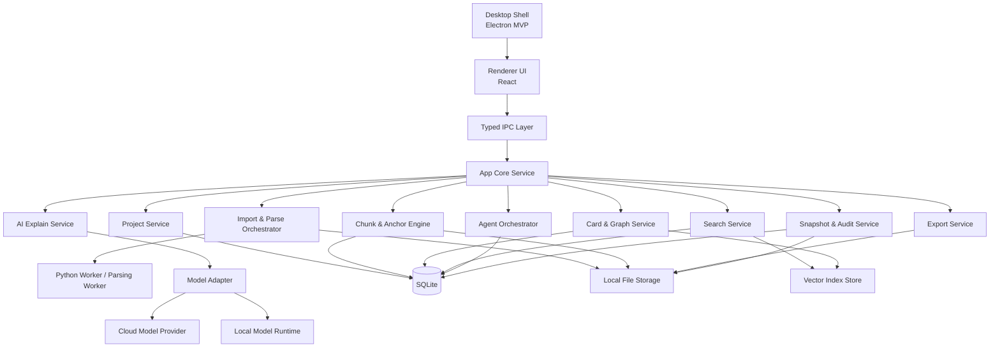
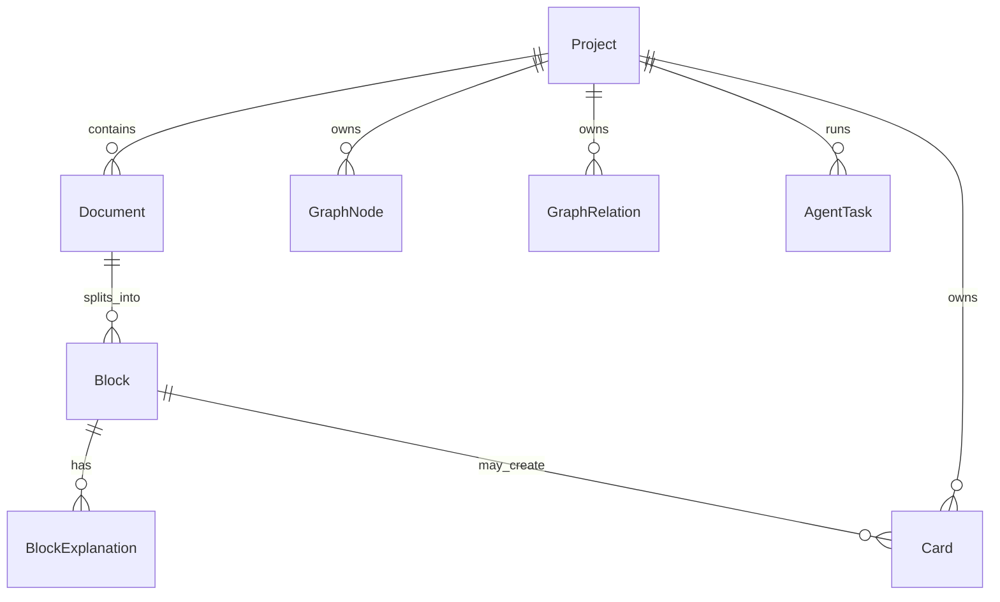
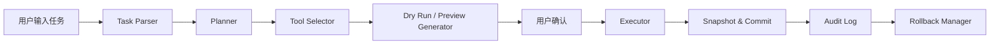

下面是把你现有**产品 PRD**，重构成一份面向研发、架构师、技术负责人可直接使用的 **《开发架构需求 PRD》**。  
这份文档的目标不是讲“产品要做什么”，而是明确：

**系统怎么拆、模块怎么分、数据怎么流、文件怎么存、Agent 怎么安全执行、MVP 技术边界在哪里。**

---

# KnowledgeOS 开发架构需求 PRD

## 0. 文档信息

**文档名称**：KnowledgeOS 开发架构需求 PRD  
**版本**：V1.0  
**文档类型**：研发架构需求 / 技术立项文档  
**对应产品 PRD 版本**：产品需求文档 V1.0  
**适用对象**：CTO、架构师、前端、客户端、后端、本地引擎、AI 工程师、测试  
**目标**：将产品 PRD 转换为可执行的技术架构要求，指导 MVP 研发拆解、架构设计、数据建模和开发排期。

---

# 1. 项目一句话定义

KnowledgeOS 是一个**桌面端、本地优先、AI 驱动的学习知识工作台**。  
系统将 PDF / PPT / DOCX / MD / TXT 等学习资料统一转换为 Markdown 中间层，进一步切分为可追溯的知识块，并通过块级 AI 解读、知识卡片、知识图谱和本地 Agent，将资料转化为长期可维护的知识网络。

---

# 2. 开发目标

## 2.1 架构目标

本系统架构必须支持以下核心闭环：

**本地导入 → 统一转换 → 结构化切块 → 块级 AI 解读 → 卡片沉淀 → 图谱构建 → Agent 整理执行 → 导出知识库**

## 2.2 MVP 研发目标

MVP 阶段研发只需要确保以下链路稳定可用：

1. 用户创建 Project
    
2. 导入本地文件夹或多个文档
    
3. 文档被解析并统一转为 Markdown 中间层
    
4. Markdown 被切分为稳定 Block
    
5. 阅读器可逐块查看并触发 AI 解读
    
6. 用户可将块或 AI 解释保存为 Card
    
7. 系统可构建基础知识图谱
    
8. 用户可发起本地 Agent 任务
    
9. Agent 支持预览、确认、执行、撤销
    
10. Project 可导出为本地知识库结构
    

## 2.3 非目标

以下不进入 MVP 技术架构范围：

- 云端实时协同
    
- 多人编辑冲突解决
    
- 跨设备同步
    
- 企业级账号系统
    
- 大规模在线服务端架构
    
- 社区内容平台
    
- 复杂 OCR 全覆盖
    
- 论文代码执行环境集成
    

---

# 3. 核心架构原则

## 3.1 Local-first

所有原始文件、转换结果、知识结构、索引、日志默认保存在本地。

## 3.2 Source-grounded

每条 AI 输出、每张卡片、每条图谱关系都必须能回溯到源文档块。

## 3.3 Block-first

系统的最小知识处理单元不是整篇文档，而是 **Block**。

## 3.4 Controlled Automation

本地 Agent 所有写操作必须经过：  
**计划 → 预览 → 确认 → 执行 → 记录 → 回滚**

## 3.5 Open Storage

内部优先使用 Markdown、JSON、SQLite 等开放格式，便于未来兼容 Obsidian、JSON Canvas、Zotero 等生态。

## 3.6 UI 与核心引擎解耦

界面层不得直接承担解析、索引、模型调用、文件修改逻辑，所有核心能力必须收敛到本地服务层。

---

# 4. 技术边界与系统边界

## 4.1 系统边界内

本系统负责：

- 本地文件导入
    
- 文档解析与标准化
    
- Markdown 中间层生成
    
- 块切分与锚点映射
    
- AI 解读与缓存
    
- 卡片与图谱构建
    
- 本地搜索与向量检索
    
- Agent 任务规划与执行
    
- 本地变更日志与回滚
    
- 项目导出
    

## 4.2 系统边界外

本系统暂不负责：

- 云端对象存储
    
- 实时多人协作
    
- SaaS 管理后台
    
- 中央化账号鉴权
    
- 分布式数据库
    
- 大规模在线文档同步
    

## 4.3 外部依赖边界

可选外部依赖：

- 云端 LLM API
    
- 本地模型运行时
    
- 本机文件系统
    
- OS Keychain / Credential Store
    
- 未来的 Zotero / Obsidian 连接器
    

---

# 5. 总体技术架构

## 5.1 架构分层

建议分为 5 层：

1. **桌面容器层**
    
2. **前端交互层**
    
3. **本地应用核心层**
    
4. **本地 AI / 解析工作层**
    
5. **本地存储层**
    

## 5.2 推荐总体架构



---

# 6. 技术选型建议

## 6.1 客户端容器

### MVP 推荐

**Electron + React + TypeScript**

原因：

- 更快接入本地文件系统与 Node 生态
    
- 更适合快速集成文档处理、Python sidecar、子进程管理
    
- 对桌面端 Agent 和本地工作流更友好
    
- 工程团队更容易快速起盘
    

### 后续可评估

Tauri 适合在 V2 以后优化包体、内存和安全边界。

---

## 6.2 前端层

建议：

- React
    
- TypeScript
    
- Zustand 或 Redux Toolkit
    
- TanStack Query
    
- Monaco / Markdown Viewer 组件
    
- 图谱渲染引擎（支持中等规模节点）
    
- 虚拟列表组件用于块级长文档渲染
    

---

## 6.3 本地核心层

建议：

- Node.js / TypeScript 作为 App Core
    
- 所有业务能力以独立 Service / Domain Module 组织
    
- 前端与核心层通过 **typed IPC** 通信
    
- 禁止前端直接访问文件系统和模型 provider
    

---

## 6.4 文档处理工作层

建议单独拆为 Worker：

- Python Worker：负责 PDF / PPTX / DOCX 解析、结构抽取、图片资产处理
    
- 后续可加入 Rust Worker 或更高性能解析器
    

原因：

- 文档解析工具链在 Python 生态中更成熟
    
- 便于后续扩展 OCR、公式解析、表格识别
    
- 与 UI 进程隔离，更安全
    

---

## 6.5 存储层

### MVP 推荐组合

- **SQLite**：元数据、项目数据、Block、Card、Relation、Task、日志
    
- **本地文件系统**：原文、Markdown 中间层、资产文件、导出结果、快照
    
- **本地向量索引**：用于语义搜索和关系候选召回
    

### 原则

MVP 不引入重型分布式数据库或外部服务。

---

# 7. 核心模块拆分

## 7.1 模块总览

|模块|职责|优先级|
|---|---|---|
|Desktop Shell|桌面生命周期、窗口、IPC、安全边界|P0|
|Project Service|项目创建、路径管理、项目状态|P0|
|Import Service|文件导入、去重、队列管理|P0|
|Parse Service|文档解析、格式抽取、资产提取|P0|
|Markdown Normalize Service|统一中间层生成|P0|
|Chunk Engine|块切分、锚点映射、Block ID 稳定化|P0|
|Explain Service|块级 AI 解读、缓存、结构化输出|P0|
|Card Service|卡片创建、编辑、标签管理|P0|
|Graph Service|节点与关系生成、关系建议|P0|
|Search Service|全文检索、语义检索、过滤|P0|
|Agent Orchestrator|任务规划、预览、执行、回滚|P0|
|Snapshot & Audit|快照、diff、审计日志|P0|
|Export Service|导出 Markdown / 项目结构|P1|
|Model Adapter|云模型 / 本地模型适配|P1|
|Connector Layer|Zotero / Obsidian 等生态连接|P2|

---

# 8. 核心领域对象与数据模型

系统必须围绕以下核心对象设计。

## 8.1 核心对象

### Project

一个学习主题或课程级工作空间。

关键字段：

- project_id
    
- name
    
- root_path
    
- description
    
- created_at
    
- updated_at
    
- status
    

### Document

原始导入文档及其标准化结果。

关键字段：

- document_id
    
- project_id
    
- source_path
    
- source_type
    
- source_hash
    
- normalized_md_path
    
- manifest_path
    
- title
    
- parse_status
    
- imported_at
    

### Block

系统最小阅读与解读单元。

关键字段：

- block_id
    
- project_id
    
- document_id
    
- block_type
    
- heading_path
    
- order_index
    
- content_md
    
- token_count
    
- source_anchor
    
- parent_block_id
    
- created_at
    

### BlockExplanation

块级 AI 输出对象。

关键字段：

- explanation_id
    
- block_id
    
- mode
    
- summary
    
- key_concepts_json
    
- prerequisites_json
    
- pitfalls_json
    
- role_in_document
    
- related_candidates_json
    
- model_name
    
- prompt_version
    
- created_at
    
- cache_key
    

### Card

用户沉淀下来的知识卡片。

关键字段：

- card_id
    
- project_id
    
- source_block_id
    
- source_explanation_id
    
- title
    
- content_md
    
- tags_json
    
- created_by
    
- created_at
    
- updated_at
    

### GraphNode

图谱节点。

节点类型建议：

- document
    
- block
    
- card
    
- concept
    
- topic
    

### GraphRelation

图谱边。

字段建议：

- relation_id
    
- project_id
    
- from_node_id
    
- to_node_id
    
- relation_type
    
- confidence
    
- origin_type
    
- source_ref
    
- confirmed_by_user
    
- created_at
    

### AgentTask

本地 Agent 任务。

字段建议：

- task_id
    
- project_id
    
- task_text
    
- task_type
    
- status
    
- plan_json
    
- preview_json
    
- approval_required
    
- execution_log_path
    
- rollback_ref
    
- created_at
    
- updated_at
    

---

## 8.2 实体关系



---

# 9. 文件与目录架构要求

系统需要一套清晰的本地目录布局，支持原文、标准化、缓存、导出、回滚。

## 9.1 推荐目录结构

```text
KnowledgeOS/
  app.db
  projects/
    {project_id}/
      source/
        original-files...
      normalized/
        docs/
          {document_id}.md
        manifests/
          {document_id}.json
        assets/
          {document_id}/
      blocks/
        {document_id}.jsonl
      cards/
      exports/
      snapshots/
      logs/
      temp/
```

## 9.2 目录要求

- source 只保存原始导入文件或其链接信息
    
- normalized 保存 Markdown 中间层与结构元数据
    
- assets 保存图片、页面截图、抽取出的媒体资源
    
- blocks 保存切块结果
    
- snapshots 保存 Agent 变更前快照
    
- exports 保存导出结果
    
- logs 保存任务日志和错误日志
    

---

# 10. 文档标准化架构要求

这是整个系统最关键的底座。

## 10.1 标准化目标

所有导入文件必须被转换为统一的 **Markdown 中间层 + Manifest 描述文件**。

## 10.2 标准化输出

每个导入文档至少生成两类文件：

### A. Markdown 正文

用于阅读和切块。

### B. Manifest 元数据

记录：

- 文档标题
    
- 原始路径
    
- 文档类型
    
- 页码 / 幻灯片号
    
- 章节层级
    
- 图片资产映射
    
- 表格映射
    
- 原文锚点映射
    
- 解析告警
    
- 解析时间
    

## 10.3 解析策略

### PDF

优先支持文本型 PDF。  
输出要求：

- 页码保留
    
- 标题和正文尽可能保真
    
- 图表位置用占位标记
    
- 表格以弱结构表示
    
- 扫描件 PDF 在 MVP 中只做有限支持，允许标记为低质量解析
    

### PPT / PPTX

每页幻灯片转为 Markdown section：

- 标题
    
- 主体要点
    
- 备注区（如可读）
    
- 图片占位引用
    
- slide_index
    

### DOC / DOCX

保留：

- 标题层级
    
- 正文段落
    
- 列表
    
- 表格弱表示
    
- 图片引用
    

### Markdown / TXT

只做标准化清洗，不做复杂解析。

## 10.4 解析状态机

文档状态建议：

- imported
    
- parsing
    
- normalized
    
- chunked
    
- indexed
    
- ready
    
- failed
    

---

# 11. Block 切分架构要求

## 11.1 切分目标

系统必须将标准化文档切成可读、可解释、可引用、可追溯的 Block。

## 11.2 切分原则

优先采用两阶段策略：

### 第一阶段：结构切分

依据：

- 标题层级
    
- 页码 / 幻灯片
    
- 段落
    
- 图表块
    
- 表格块
    

### 第二阶段：语义修整

对过大块做二次拆分，对过小块做合理合并。

## 11.3 Block 技术要求

每个 Block 必须具备：

- 稳定 block_id
    
- 原文来源锚点
    
- 文档内顺序
    
- 父子层级
    
- Markdown 正文
    
- token 估计值
    
- 可直接喂给 AI 的最小上下文
    

## 11.4 Block ID 设计要求

Block ID 必须在以下场景尽量稳定：

- 项目重启
    
- 索引重建
    
- AI 解释重新生成
    
- 文档未发生实质变化的重复导入
    

建议基于：

`document_id + heading_path + source_anchor + content_hash`

---

# 12. 阅读器与块级解读架构要求

## 12.1 阅读器架构要求

阅读器不是普通文档 viewer，而是一个 **Block 驱动的阅读工作台**。

阅读器必须支持：

- Block 树导航
    
- 当前 Block 主视图
    
- 原文位置回跳
    
- Block 收藏
    
- Block 注释
    
- 一键生成解读
    
- 一键保存为卡片
    

## 12.2 块级 AI 解读输出要求

Explain Service 输出必须为**结构化 JSON**，不能只返回自由文本。

建议结构：

```json
{
  "summary": "本块摘要",
  "key_concepts": [
    {"term": "概念A", "explanation": "解释"}
  ],
  "role_in_document": "这一段在整篇资料中的作用",
  "prerequisites": ["先修知识1"],
  "pitfalls": ["常见误区1"],
  "examples": ["例子1"],
  "related_candidates": [
    {"label": "相关概念", "relation_hint": "前置知识", "confidence": 0.78}
  ]
}
```

## 12.3 Explain Service 技术要求

- 支持多解释模式：默认 / 入门 / 考试 / 科研
    
- 输出必须绑定 block_id
    
- 输出必须版本化
    
- 支持缓存
    
- 支持重算
    
- 支持模型切换
    
- 支持失败重试
    

## 12.4 Prompt 与输出控制要求

- Prompt 模板需要版本管理
    
- 所有结构化输出必须走 schema 校验
    
- 非法 JSON 必须自动重试或降级修复
    
- 同一 block 的缓存 key 需包含模型、模式、prompt_version
    

---

# 13. 知识卡片与知识图谱架构要求

## 13.1 卡片架构要求

Card 不是普通笔记，而是从 Block 或解释中提炼出的知识实体。

卡片创建入口：

- 从原文 Block 保存
    
- 从 AI 解释保存
    
- 手动新建
    
- 未来支持批量生成
    

卡片必须保留：

- 来源 block_id
    
- 来源 explanation_id
    
- 创建方式
    
- 标签
    
- 与图谱关系
    

---

## 13.2 图谱建模要求

图谱层不能直接把所有 Block 全量变为节点，否则噪声过大。  
MVP 建议以以下对象为核心节点：

- Card
    
- Concept
    
- Document
    
- Topic
    

Block 可作为来源引用，不一定默认进入图谱主视图。

## 13.3 图谱关系来源

关系来源分三类：

1. 用户手动创建
    
2. 系统规则推断
    
3. AI 建议待确认
    

## 13.4 图谱服务要求

必须支持：

- 节点搜索
    
- 节点详情
    
- 从节点回到来源块
    
- 关系新增 / 删除
    
- 关系建议
    
- 子图过滤
    
- 文档维度过滤
    
- 主题维度过滤
    

---

# 14. 搜索架构要求

## 14.1 搜索类型

MVP 需要支持两类检索：

### A. 全文搜索

基于：

- Project
    
- Document
    
- Block
    
- Card
    

### B. 语义搜索

基于：

- Block embedding
    
- Card embedding
    
- Concept embedding
    

## 14.2 搜索实现要求

推荐使用混合检索：

- SQLite FTS 做关键词搜索
    
- 向量索引做语义召回
    
- 排序层做融合重排
    

## 14.3 搜索结果要求

每条结果必须返回：

- entity_type
    
- entity_id
    
- title / snippet
    
- source project
    
- source document
    
- source anchor
    
- jump target
    

---

# 15. Agent 架构要求

这是 MVP 的高风险高价值模块，必须单独设计。

## 15.1 Agent 架构目标

用户通过自然语言发起知识整理任务，系统在**本地受控沙盒**内完成计划、预览、执行和回滚。

## 15.2 Agent 执行链路



## 15.3 Agent 子模块

### Task Parser

识别任务类型，例如：

- 目录整理
    
- 重命名
    
- 标签补全
    
- 卡片合并
    
- 图谱关系补全
    
- 导出项目
    

### Planner

将自然语言任务拆成结构化 plan。

### Tool Registry

定义可调用工具集合。

### Preview Generator

预计算会影响哪些文件、卡片、关系。

### Executor

执行已获批准的动作。

### Snapshot Manager

保存执行前状态。

### Rollback Manager

支持回滚最近一次或指定任务。

---

## 15.4 Tool 设计要求

MVP 工具集合建议限定为：

- read_project_tree
    
- read_document
    
- rename_file
    
- move_file
    
- update_markdown
    
- merge_cards
    
- update_tags
    
- create_relation
    
- remove_relation
    
- export_project
    

不开放任意 shell 执行。

## 15.5 Agent 安全要求

- 所有写操作必须限定在 project_root
    
- 不允许访问 project_root 之外路径
    
- 不允许直接执行任意系统命令
    
- 不允许跳过确认直接写入
    
- 任何 destructive action 必须记录快照
    
- 所有变更必须可回滚
    

## 15.6 Agent 状态机

任务状态建议：

- drafted
    
- planned
    
- awaiting_approval
    
- executing
    
- completed
    
- failed
    
- rolled_back
    
- cancelled
    

---

# 16. 应用核心服务接口要求

为降低 UI 与核心引擎耦合，建议内部统一使用命令式接口。

## 16.1 前端到核心层的命令接口

建议至少提供以下命令：

- `createProject(payload)`
    
- `openProject(projectId)`
    
- `importFiles(projectId, paths[])`
    
- `getProjectTree(projectId)`
    
- `getDocument(documentId)`
    
- `getBlocks(documentId | projectId)`
    
- `getBlock(blockId)`
    
- `explainBlock(blockId, mode)`
    
- `saveCard(payload)`
    
- `suggestRelations(projectId, nodeIds[])`
    
- `search(projectId, query, mode)`
    
- `planAgentTask(projectId, text)`
    
- `confirmAgentTask(taskId)`
    
- `rollbackAgentTask(taskId)`
    
- `exportProject(projectId, format)`
    

## 16.2 IPC 要求

- 所有 IPC 需强类型定义
    
- 所有写操作 IPC 必须带 project_id
    
- IPC 层要做参数校验
    
- UI 不允许直接拼文件路径写入
    

---

# 17. 模型适配层架构要求

## 17.1 模型调用原则

所有模型调用必须收敛到 **Model Adapter**，不能在多个模块直接接云端 API。

## 17.2 模型任务类型

系统至少包含以下任务类型：

- 块级解释
    
- 概念抽取
    
- 关系分类
    
- 搜索 query 改写
    
- Agent 计划生成
    
- 导出摘要生成
    

## 17.3 模型适配能力

Model Adapter 必须支持：

- 云模型适配
    
- 本地模型适配
    
- openai-compatible endpoint
    
- 模型配置管理
    
- 请求日志
    
- 错误重试
    
- token 统计
    
- 成本统计
    
- 超时控制
    

## 17.4 本地与云模型路由策略

建议：

- 文档解析不依赖 LLM
    
- Block Explain 可走云或本地
    
- Agent Planner 默认可配置
    
- 搜索和基础图谱候选优先用规则 + embedding，不全部依赖 LLM
    

---

# 18. 存储与索引架构要求

## 18.1 SQLite 存储表建议

MVP 建议至少包含：

- projects
    
- documents
    
- document_assets
    
- document_manifests
    
- blocks
    
- block_explanations
    
- cards
    
- graph_nodes
    
- graph_relations
    
- tags
    
- entity_tags
    
- agent_tasks
    
- task_logs
    
- snapshots
    
- jobs
    
- settings
    

## 18.2 索引建议

- projects(name)
    
- documents(project_id, source_hash, parse_status)
    
- blocks(document_id, order_index)
    
- blocks(project_id)
    
- cards(project_id)
    
- graph_relations(project_id, from_node_id, to_node_id)
    
- agent_tasks(project_id, status)
    

## 18.3 全文检索要求

SQLite 层建议建立 FTS 表：

- blocks_fts
    
- cards_fts
    
- documents_fts
    

## 18.4 向量索引要求

MVP 阶段支持：

- Block embeddings
    
- Card embeddings
    
- Concept embeddings
    

要求：

- 可按 project_id 分区
    
- 支持重建
    
- 支持删除
    
- 支持增量更新
    

---

# 19. 后台任务与任务队列要求

## 19.1 为什么需要任务队列

因为以下操作都属于耗时任务：

- 文档解析
    
- Markdown 标准化
    
- 切块
    
- 向量生成
    
- AI 解读
    
- 图谱候选构建
    
- Agent 计划生成
    
- 导出
    

## 19.2 任务队列要求

- 本地持久化队列
    
- 支持任务状态查询
    
- 支持失败重试
    
- 支持取消
    
- 支持进度更新
    
- 支持任务依赖
    

## 19.3 任务状态

建议统一状态：

- pending
    
- running
    
- succeeded
    
- failed
    
- cancelled
    

---

# 20. 审计、快照与回滚要求

这是 Agent 与本地文件安全的底座。

## 20.1 快照要求

在以下动作前必须自动快照：

- 文件重命名
    
- 文件移动
    
- Markdown 内容修改
    
- Card 合并
    
- Relation 批量修改
    

## 20.2 快照内容

- 原文件路径
    
- 文件内容 hash
    
- 修改前内容
    
- 涉及对象 ID
    
- 修改时间
    
- 任务 ID
    

## 20.3 回滚要求

- 支持按 task_id 回滚
    
- 回滚结果写入审计日志
    
- 回滚失败要记录原因
    
- 回滚后需触发索引修复
    

---

# 21. 权限与安全架构要求

## 21.1 权限边界

### Renderer

只负责展示和交互，不可直接：

- 写本地文件
    
- 调系统 shell
    
- 调模型 API
    
- 改数据库
    

### Core Service

唯一可进行业务写操作的层。

### Worker

只接受有限命令，不可直接暴露给前端。

---

## 21.2 隐私要求

- 用户源文件默认不上传
    
- 云模型调用必须在设置中显式启用
    
- 凭证必须放 OS Keychain，不可明文落库
    
- 日志默认只保存在本地
    
- 崩溃上报必须是 opt-in
    

---

# 22. 性能要求

以下为 MVP 技术目标值，不是最终 SLA。

## 22.1 导入性能

- 单个中型文本型 PDF 能在可接受时间内完成标准化和切块
    
- 多文档导入时支持后台队列，不阻塞 UI
    
- 项目重新打开时无需重新解析已完成文档
    

## 22.2 阅读性能

- Block 列表切换需接近即时响应
    
- 已缓存解释再次打开应接近即时展示
    
- 原文定位和块跳转需明显快于传统 PDF 来回滚动
    

## 22.3 图谱性能

- 中等规模节点下支持缩放、拖拽、搜索过滤
    
- 初始不加载全量超大图，而是按过滤条件生成子图
    

## 22.4 搜索性能

- 全文搜索需快速返回首屏结果
    
- 语义搜索支持后台异步召回
    
- 结果必须附带来源与跳转能力
    

---

# 23. 可观测性与调试要求

## 23.1 日志分层

至少分为：

- app log
    
- parse log
    
- model log
    
- agent log
    
- audit log
    

## 23.2 错误可视化

用户层要能看到：

- 哪个文件导入失败
    
- 失败原因
    
- 哪个任务失败
    
- 是否可重试
    

## 23.3 开发调试能力

研发模式下建议支持：

- 查看任务队列
    
- 查看解析结果
    
- 查看 block 切分结果
    
- 查看 explanation JSON
    
- 查看 graph relation 候选
    
- 查看 agent plan / diff / rollback
    

---

# 24. 测试要求

## 24.1 测试层级

### 单元测试

覆盖：

- Block 切分
    
- ID 稳定性
    
- Prompt 输出校验
    
- 关系分类
    
- 路径沙盒校验
    

### 集成测试

覆盖：

- 导入到切块全链路
    
- Explain 缓存链路
    
- Card 保存到图谱生成链路
    
- Agent 预览到执行到回滚链路
    

### 回归样本库

必须建设一组固定测试文档：

- 教学 PDF
    
- PPTX
    
- DOCX
    
- Markdown 笔记
    
- 异常文档
    
- 大文件
    
- 混合目录项目
    

---

# 25. MVP 技术范围冻结

## 25.1 MVP 必做

- Project 管理
    
- PDF / PPTX / DOCX / MD / TXT 导入
    
- Markdown 中间层生成
    
- Block 切分与锚点映射
    
- Block 阅读器
    
- Block Explain
    
- Card 创建
    
- 基础 Graph
    
- 全文 + 语义搜索
    
- Agent 任务预览 / 确认 / 执行 / 回滚
    
- 本地导出
    

## 25.2 MVP 可弱化

- 公式理解
    
- 表格高保真还原
    
- 图片语义解释
    
- 高级图谱布局算法
    
- 多模型复杂路由
    
- 扫描 PDF OCR
    

## 25.3 MVP 不做

- 多人协作
    
- 云同步
    
- 社区功能
    
- 画布式无限白板
    
- Zotero 双向同步
    
- Obsidian 完整双向同步
    
- 代码仓库联动解释
    

---

# 26. 开发里程碑拆解

## M0：基础工程与项目系统

交付：

- Electron 壳
    
- React UI 框架
    
- SQLite 初始化
    
- 项目创建 / 打开
    
- IPC 框架
    
- 本地目录初始化
    

## M1：导入与标准化

交付：

- 导入队列
    
- 文档解析 Worker
    
- Markdown 中间层
    
- Manifest 输出
    
- 状态机
    

## M2：切块与阅读器

交付：

- Block 引擎
    
- Block 数据表
    
- 阅读器主界面
    
- 原文定位
    
- Block 基础交互
    

## M3：Explain / Card / Search

交付：

- Explain Service
    
- 缓存机制
    
- Card 保存
    
- FTS 与语义搜索
    
- 基础节点关系候选
    

## M4：Graph 与 Agent

交付：

- Graph 视图
    
- Relation 管理
    
- Agent Planner
    
- Preview / Confirm / Execute
    
- Snapshot / Rollback / Audit
    

## M5：导出与稳定性

交付：

- 导出结构
    
- 错误恢复
    
- 性能优化
    
- 回归测试通过
    

---

# 27. 建议的研发分工

## 27.1 前端 / 客户端

负责：

- Electron 集成
    
- UI 架构
    
- 阅读器
    
- 图谱页
    
- Agent 控制台
    
- IPC 调用层
    

## 27.2 核心服务

负责：

- Project / Document / Block / Card / Graph / Search 业务模块
    
- SQLite schema
    
- 本地任务队列
    
- 导出服务
    

## 27.3 AI / Agent

负责：

- Prompt 模板
    
- Explain JSON schema
    
- Model Adapter
    
- Agent Planner
    
- 工具注册
    
- Diff / 预览机制
    

## 27.4 文档解析

负责：

- Python Worker
    
- 解析器链路
    
- Markdown 标准化
    
- Manifest 与 Anchor Map
    

## 27.5 QA / 自动化

负责：

- 样本文档库
    
- 导入与切块回归
    
- Agent 回滚测试
    
- 性能回归
    

---

# 28. 关键技术决策

这份开发架构 PRD 建议先确定以下决策，再进入详细设计。

## 决策 1：客户端技术栈

建议：**Electron + React + TypeScript**

## 决策 2：核心运行形态

建议：**Renderer + App Core + Python Worker 三层**

## 决策 3：统一中间层

建议：**Markdown + Manifest + Anchor Map**

## 决策 4：最小知识单元

建议：**Block 是核心主对象**

## 决策 5：图谱主节点

建议：**Card / Concept / Topic 为主，Block 为来源引用**

## 决策 6：Agent 权限模型

建议：**白名单工具 + 预览确认 + 快照回滚**

## 决策 7：存储方案

建议：**SQLite + 本地文件系统 + 本地向量索引**

---

# 29. 开发验收标准

## 29.1 导入链路验收

- 常见 PDF / PPTX / DOCX / MD / TXT 可被导入
    
- 每份文档都能生成 Markdown 和 manifest
    
- 错误文件可见失败原因
    
- 重复导入可识别
    

## 29.2 Block 链路验收

- 文档可切成稳定 Block
    
- Block 可追溯到 source anchor
    
- 阅读器能按 Block 逐个浏览
    
- 同一文档不重复生成大量无意义碎块
    

## 29.3 Explain 链路验收

- Block 可生成结构化 Explain
    
- Explain 可缓存
    
- Explain 可重新生成
    
- Explain 可保存为 Card
    

## 29.4 Graph 链路验收

- Card 可生成节点
    
- 关系可新增 / 删除
    
- 节点可跳回源 Block
    
- 图谱对阅读和复习有实际导航作用
    

## 29.5 Agent 链路验收

- 自然语言任务可生成 plan
    
- plan 可转 preview
    
- preview 可确认
    
- 执行后有日志
    
- 回滚可恢复
    

---

# 30. 当前架构风险与应对

## 风险 1：文档解析结果不稳定

应对：  
先统一中间层，不追求原文像素级还原；建立回归样本文档库。

## 风险 2：Block 切分质量差

应对：  
采用“结构优先 + 语义修整”策略；把块大小控制纳入测试。

## 风险 3：Explain 输出不稳定

应对：  
强制 JSON schema；版本化 prompt；不通过 schema 的结果重试。

## 风险 4：Graph 噪声过大

应对：  
MVP 图谱只围绕 Card / Concept，而非全量 Block 自动上图。

## 风险 5：Agent 误操作本地文件

应对：  
工具白名单、路径沙盒、预览确认、快照回滚，四层保护。

## 风险 6：核心层过于耦合

应对：  
UI、Core、Worker 三层解耦；模型调用统一走适配层。

---

# 31. 结论

从研发角度，这个产品真正的核心不是“加一个 AI 聊天框”，而是建立四个稳定底座：

1. **文档标准化中间层**
    
2. **Block 级知识处理模型**
    
3. **本地可追溯知识图谱**
    
4. **可控、可回滚的本地 Agent 执行框架**
    

一句话概括这份开发架构需求 PRD：

**KnowledgeOS 的研发核心，是构建一个以 Block 为中心、以 Markdown 为中间层、以本地 Agent 为执行器、以图谱为知识呈现层的桌面端本地知识操作系统。**

下一步最适合继续拆的是：**数据库表结构 PRD + IPC/API 接口清单 + MVP 技术架构图**。